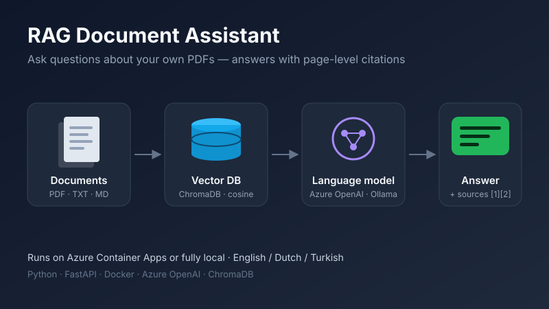

# rag-demo — RAG document assistant with a guarded agent, local or on Azure

[](https://github.com/Elcebir71/rag-demo/actions/workflows/tests.yml)



A small **Retrieval-Augmented Generation (RAG)** service in plain Python. It indexes
your documents, retrieves the passages most relevant to a question, and lets a language
model answer from those passages only, citing the file and page each claim came from.

The same code runs in two modes, selected by environment variables:

| | Local | Cloud |
|---|---|---|
| Chat model | Ollama `llama3.2` | Azure OpenAI `gpt-5-mini` |
| Embeddings | Ollama `bge-m3` | Azure OpenAI `text-embedding-3-small` |
| Hosting | your machine | Azure Container Apps |
| Cost / keys | free, no keys | pay per token, key stored as a secret |

**Live demo:** https://rag-demo.orangeocean-d98c39b7.swedencentral.azurecontainerapps.io
(scales to zero when idle, so the first request can take a few seconds)

## How it works

```
docs/  (PDF, TXT, MD)
   │  ingest.py   split into overlapping chunks → embed → store in ChromaDB
   ▼
db/    (vector database, one collection per embedding model)
   │  ask.py / api.py   embed the question → retrieve top-4 chunks → ask the model
   ▼
Answer with source citations  [1] file.pdf, page 13
```

| File | Role |
|---|---|
| `config.py` | Settings and backend selection from environment variables |
| `llm_client.py` | One interface (`embed`, `chat`) over Azure OpenAI and Ollama, with rate-limit retries |
| `ingest.py` | **Indexing** — read documents, chunk, embed, store |
| `ask.py` | **Retrieval + generation** from the command line |
| `api.py` | The same pipeline as a REST API (FastAPI) |
| `tools.py` | Agent tool registry: schemas, risk levels, validation and business rules |
| `store.py` | Agent state in SQLite: actions, audit log, notes, outbox |
| `agent.py` | Agent loop, approve and reject |
| `tests/` | Tests for the agent's guarantees, with a scripted fake model |
| `Dockerfile` | Container image with the app and the prebuilt index |

## API

| Method | Path | Purpose |
|---|---|---|
| `GET` | `/health` | Liveness check; also reports the active backend |
| `POST` | `/ask` | Body `{"question": "..."}` → `{"answer": "...", "sources": [...]}` |
| `GET` | `/docs` | Interactive OpenAPI page |
| `POST` | `/agent` | Body `{"message": "..."}` → answer plus the actions the agent proposed (needs `x-admin-key`) |
| `GET` | `/actions?status=pending` | Actions waiting for review (needs `x-admin-key`) |
| `POST` | `/actions/{id}/approve` or `/reject` | Human decision (needs `x-admin-key`) |
| `GET` | `/actions/{id}/audit` | Audit trail of one action (needs `x-admin-key`) |

```json
{
  "answer": "IaaS requires the most user management: you manage the operating systems, data and applications ... [1][3]",
  "sources": [
    {"source": "file.pdf", "page": 13, "similarity": 0.65},
    {"source": "file.pdf", "page": 15, "similarity": 0.51}
  ]
}
```

## Agent with guarded actions

The assistant can also act: search the documents, save notes and send email.
The agent currently runs locally; the live demo serves the RAG endpoints above.
The design follows one rule: **the model proposes, the application decides.**
A prompt guides the model's reasoning, but permissions, validation, approval and
recovery are enforced in code, where no prompt or document can change them.

```
request ─▶ model proposes tool calls
              │
              ▼
        tools.validate()  ── unknown tool, bad arguments,
              │              recipient not on allowlist ──▶ rejected (logged)
              ▼
         risk level?
     read / low ──▶ run now ──▶ done / failed (logged)
     high ───────▶ pending ──▶ human approves with admin key ──▶ re-check ──▶ run
```

| Tool | Risk | What the application does |
|---|---|---|
| `search_documents` | read | Runs automatically |
| `save_note` | low | Runs automatically and is logged |
| `send_email` | high | Waits for approval; recipient must be on `EMAIL_ALLOWLIST` |

**Guarantees, each covered by a test in `tests/`**

- Unknown tools, extra fields and malformed arguments are rejected (strict Pydantic schemas).
- A recipient outside the allowlist is rejected, even when a document contains
  an injected instruction and the model follows it.
- Nothing high-risk runs without approval, and approval needs `ADMIN_API_KEY`.
  Without a configured key, approvals are disabled (fail closed).
- Approving twice runs once: every status change is a conditional update.
- Rules are checked again at approval time, not only at proposal time.
- Failures are recorded, never lost; the loop stops after `MAX_STEPS` rounds.
- Every status change is written to an audit log.

Email runs in **demo mode**: an approved email goes to an `outbox` table and is not
sent. A public demo that sends real email could be abused as a spam relay.

**Limits of this demo, stated openly**

- `/agent` needs the admin key too. Each request can make up to `MAX_STEPS` model calls,
  so a public agent endpoint would let anyone spend the Azure budget.
- Agent state is SQLite inside the container. With `--min-replicas 0` the container stops
  when idle, and pending actions and the audit log are lost. Fine for a demo where an
  action is approved within minutes; a real deployment would use PostgreSQL (see roadmap).
  
**Model choice, measured, not assumed.** Same tool definition, three runs each:

| Model | System prompt | Unwanted tool calls | Correct tool calls |
|---|---|---|---|
| llama3.2 (3B) | no | 3/3 | 3/3 |
| llama3.2 (3B) | yes | 1/3 | 3/3 |
| qwen2.5:7b | no | 0/3 | 3/3 |
| qwen2.5:7b | yes | 0/3 | 3/3 |

`qwen2.5:7b` is the default (`AGENT_MODEL`). Known limitation: after a document
search it often asks the user for confirmation instead of proposing the next
action. The guarantees above do not depend on the model; its usefulness does.

**Try it**

```bash
# PowerShell: $env:EMAIL_ALLOWLIST = "jan@example.com"; $env:ADMIN_API_KEY = "local-test-key"
python agent.py "Email jan@example.com with subject 'Test' and body 'Hello'"
python agent.py --approve <id>   # the id printed by the previous command
python -m pytest -q              # needs: pip install -r requirements-dev.txt
```

The agent's endpoints are listed in the API table above.

## Run locally (free, no keys)

```bash
ollama pull bge-m3
ollama pull llama3.2
ollama pull qwen2.5:7b              # only for the agent

python -m venv .venv
.venv\Scripts\activate            # macOS/Linux: source .venv/bin/activate
pip install -r requirements.txt

python ingest.py                  # index everything in docs/
python ask.py "your question"     # command line
python -m uvicorn api:app --reload   # REST API on http://127.0.0.1:8000/docs
```

## Run against Azure OpenAI

Set two environment variables and the app switches backend. The key is read straight
from Azure into the shell, so it is never written to a file (PowerShell shown):

```powershell
$env:AZURE_OPENAI_ENDPOINT = az cognitiveservices account show -n <aoai-name> -g <rg> --query properties.endpoint -o tsv
$env:AZURE_OPENAI_API_KEY  = az cognitiveservices account keys list -n <aoai-name> -g <rg> --query key1 -o tsv

python ingest.py                  # rebuilds the index with Azure embeddings
python ask.py "your question"
```

Optional variables: `AZURE_CHAT_DEPLOYMENT` (default `chat`), `AZURE_EMBED_DEPLOYMENT`
(default `text-embedding-3-small`), `AZURE_REASONING_EFFORT` (default `low`).

## Deploy to Azure Container Apps

```powershell
# One-time infrastructure
az group create -n <rg> -l swedencentral
az acr create -g <rg> -n <acr> --sku Basic
az containerapp env create -n <env> -g <rg> -l swedencentral

# Build and push the image
docker build -t rag-demo .
az acr login -n <acr>
docker tag rag-demo <acr>.azurecr.io/rag-demo:v2
docker push <acr>.azurecr.io/rag-demo:v2

# Create the app (image pulled with a managed identity, no registry password)
az containerapp create -n rag-demo -g <rg> --environment <env> `
  --image <acr>.azurecr.io/rag-demo:v2 --registry-server <acr>.azurecr.io --registry-identity system `
  --target-port 8000 --ingress external --min-replicas 0 --max-replicas 1 `
  --secrets "aoai-key=$env:AZURE_OPENAI_API_KEY" `
  --env-vars "AZURE_OPENAI_ENDPOINT=$env:AZURE_OPENAI_ENDPOINT" "AZURE_OPENAI_API_KEY=secretref:aoai-key"
```

## Design choices

- **One code base, two backends.** Configuration comes from the environment
  (twelve-factor style), so nothing changes between laptop and cloud.
- **No secrets in code or in the image.** The API key is a Container Apps secret,
  referenced by the environment variable; the registry is accessed with a managed identity.
- **Deployment alias.** The app calls a deployment named `chat`, not a model name.
  Swapping the model when one is retired needs no code change.
- **Scale to zero.** `min-replicas 0` keeps idle cost near zero at the price of a cold start.
- **Data residency.** Embeddings use a Data Zone (EU) deployment. The chat model uses a
  Global deployment because that was the only quota available on the subscription; with
  personal data this would be a Data Zone or regional deployment instead.
- **Separate index per embedding model.** Vectors from different models are not comparable,
  so each backend writes to its own ChromaDB collection.
- **Grounding.** The system prompt restricts answers to the retrieved context and asks for
  numbered citations; the model says "I don't know" when the context has no answer.
- **Robust indexing.** Small batches, automatic wait-and-retry on HTTP 429, and a
  chunk-by-chunk fallback so one bad chunk does not stop the run.
- **Basic abuse protection.** Questions are limited to 500 characters and the model
  deployment has a low requests-per-minute cap.

## Documents

`docs/` and `db/` are not in this repository. The index is baked into the container image
at build time, so the image contains the text of the indexed documents. Only index
documents you are allowed to publish.

## Roadmap

- [x] REST API with FastAPI
- [x] Docker image
- [x] Azure Container Apps + Azure OpenAI
- [x] Agent with tool calling, human approval, audit log and tests
- [ ] Agent state in PostgreSQL (SQLite inside the container is lost on restart)
- [ ] Azure AI Search instead of an index baked into the image
- [ ] CI/CD with GitHub Actions
- [ ] Managed identity for Azure OpenAI (no API key at all)
- [ ] `.docx` and scanned PDF (OCR) support

## Author

Hakan Şahin — [hakansahin.dev](https://hakansahin.dev)
